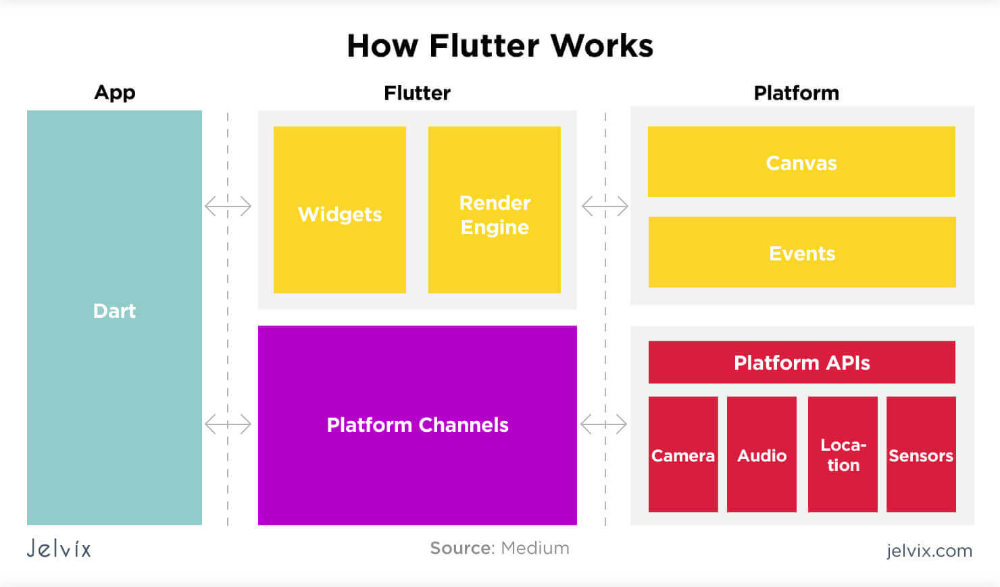
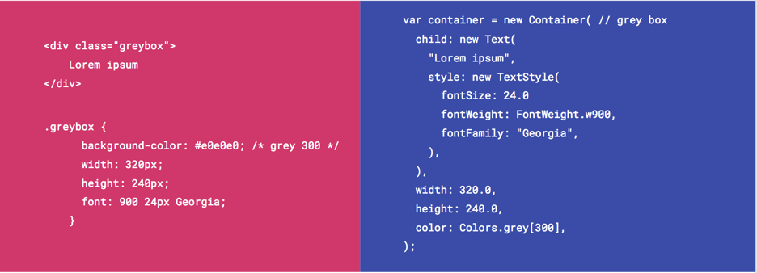

# Hello World com Flutter 🌎

# O que é Flutter?
#### "Flutter is Google’s UI toolkit for building beautiful, natively compiled applications for mobile, web, and desktop from a single codebase."

---

## Como funciona? 🤔

---

## Comparação 📈

---

## Código 🖥️
#### Pokedex!

---

Referências
- [Flutter Page](https://flutter.dev/)
- [Flutter Docs](https://flutter.dev/docs)
- [Basic Widgets](https://flutter.dev/docs/development/ui/widgets/basics)
- [HTTP Package](https://pub.dev/packages/http)

---

Perguntas?

---

Valeu!

---
- [Repositório](https://github.com/humanolaranja/flutter_hello)